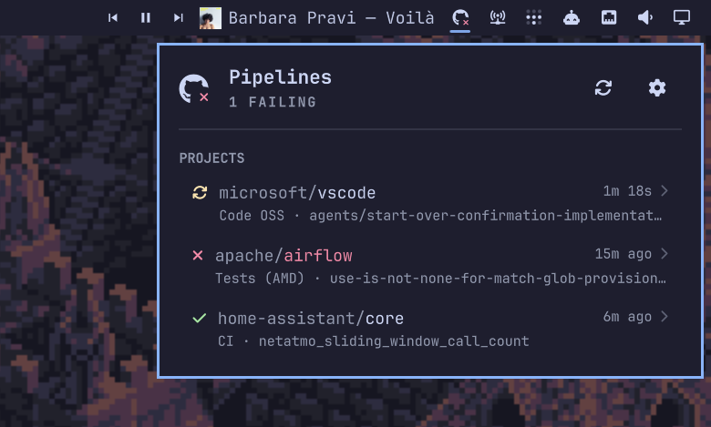

# Pipelines

Track GitHub Actions across all your projects from the Omarchy bar.

One indicator that stays silent while everything is green, turns red the moment
a build breaks, and spends almost none of your GitHub API quota doing it.



The bar shows a GitHub mark with a small status badge on it, the way a CI
favicon works in a browser tab: a check when everything passed, a dot while
something is running, a cross when something failed. Nothing configured yet is
just the bare mark. The mark never changes, so the widget always looks like
itself; only the badge does.

Status colours come from your active Omarchy theme's own palette — the same
green, amber and red the rest of your desktop uses — read from the theme's
`colors.toml` and re-read when you switch themes. One table drives the bar
badge and every row in the panel, so a state never looks like two different
things depending on where you see it.

Nothing about the icon animates.

Click it for the project list, click a project for its workflows, click a
workflow to open the run on GitHub.

Each project is captioned with the workflow the row is actually about and the
branch it ran on — the failing one when the row is red, not simply the newest —
so a broken project names what broke without being opened. A run still in
flight shows the time it has been going, counting up live.

## Why it is cheap to run

A naive CI widget polls every repository on a timer and burns through the hourly
rate limit — which matters, because that limit is shared with your `gh` CLI,
your editor and your scripts. This one is built around two facts:

1. **A conditional request that matches costs nothing.** Every repository's
   `ETag` is stored, every poll sends `If-None-Match`, and GitHub answers an
   unchanged repository with a `304` that is **not** charged against the rate
   limit. Verified against the live API: two consecutive conditional requests
   both reported the same `x-ratelimit-remaining`.
2. **The quota is not ours alone.** A configurable share of the hourly limit
   (25% by default) is reserved and never spent. The poll interval is then
   computed to fit the *remaining* budget into the *remaining* window, assuming
   the worst case of one charged request per repository. If the budget is thin,
   the interval stretches automatically instead of failing at the end of the
   hour.

On top of that the cadence adapts: fast while the panel is open, medium while a
run is in progress, slow when everything is green and nobody is looking. The
cache is written to disk, so a shell restart repaints instantly and revalidates
for free rather than re-fetching everything.

None of this is surfaced in the panel. It is the plugin's job to stay
within its budget, not the user's job to watch it do so.

## Install

```sh
git clone https://github.com/jfg96/omarchy-pipelines.git
cd omarchy-pipelines
./install.sh
```

`install.sh` installs the plugin and fetches a checksum-verified prebuilt
helper from the latest release. To build the helper from source instead, which
needs a Rust toolchain:

```sh
omarchy plugin add https://github.com/jfg96/omarchy-pipelines.git
cd ~/.config/omarchy/plugins/oma.pipelines && ./build.sh
```

Either way, the plugin does nothing until the helper exists — `omarchy plugin
add` on its own is not enough. Then add **Pipelines** to your bar from *Bar
settings* and restart the shell.

## Connect a GitHub account

Open the panel. If you already use the GitHub CLI, **Import from GitHub CLI** is
one click and needs nothing else.

Otherwise paste a [fine-grained token](https://github.com/settings/tokens?type=beta)
with read access to **Actions** and **Metadata** on the repositories you want to
watch. It is validated against the API before it is stored, so a bad token tells
you immediately instead of silently never refreshing.

The token goes into your login keyring through `secret-tool`. If the keyring is
locked or unavailable it falls back to a `0600` file, and the panel says so
rather than letting you assume otherwise. See [SECURITY.md](SECURITY.md).

## Add projects

Type `owner/repository` in settings, or paste a GitHub URL — `https://github.com/owner/repo/actions`
works fine. The field validates as you type: shape and duplicates instantly,
then existence and access against the API a moment later.

Drag the handle to reorder, or select a row and press `J` / `K`. The order in
the list is the order in the panel.

The panel is fully keyboard-driven: arrows move, `Enter` opens, `Escape` goes
back, `,` opens settings, `r` refreshes, `Tab` focuses the text field, and
`J` / `K` reorder the selected project.

**Mute** a project to keep polling it without letting it colour the bar — useful
for the one repository with a known-broken nightly that would otherwise hold the
indicator red forever.

## Settings

Refresh cadence, quota reserve and notifications live in *Bar settings →
Pipelines*, because they are declared in the manifest and Omarchy renders them
natively. The project list is edited in the panel.

| Setting | Default | What it does |
| --- | --- | --- |
| Refresh while open | 15s | Cadence while the panel is open on any monitor |
| Refresh while running | 30s | Cadence when a workflow is queued or running |
| Refresh while idle | 180s | Cadence when everything is green and closed |
| API quota kept free | 25% | Share of the hourly limit never spent |
| Notify on failure | on | Desktop notification when a workflow starts failing |
| Notify on recovery | off | Desktop notification when it goes green again |

Notifications fire on *transitions* only, so a build that is already red stays
quiet, and a shell restart does not re-announce failures you have already seen.

## Status meanings

| Badge | State | Meaning |
| --- | --- | --- |
| red cross | Failing | Latest run of some workflow failed, timed out, or needs a human |
| amber dot | Running | Something is queued or in progress |
| green check | Passing | Latest run of every workflow succeeded |
| grey dot | Stale or unknown | The last poll failed, or there is nothing to interpret |
| no badge | Empty | Nothing configured, or no account connected |

The bar shows the worst state across every unmuted project.

Cancelled and skipped runs are deliberately **not** failures. A run someone
stopped on purpose, or one skipped by a path filter, is not a broken build, and
counting it as one teaches people to ignore the light.

## Command line

```sh
omarchy shell oma.pipelines toggle
omarchy shell oma.pipelines refresh
omarchy shell oma.pipelines status
```

`status` prints JSON, so it composes:

```sh
omarchy shell oma.pipelines status | jq -r '.summary.worst'
```

## How it is put together

| File | Role |
| --- | --- |
| `Service.qml` | Loaded once per session. Owns the helper, the snapshot, IPC and all writes to `shell.json`. |
| `Panel.qml` | Built once per monitor. A view; owns only its own cursor and fields. |
| `Model.js` | Pure functions shared by both, tested under node. |
| `backend/` | Rust helper: HTTP, auth, rate limiting, caching. |

The helper speaks newline-delimited JSON on stdin/stdout. It holds no
configuration of its own — the shell owns that in `shell.json` and pushes it
down on every change.

Contributions: [CONTRIBUTING.md](CONTRIBUTING.md). Working with an AI agent in
this repository: [AGENTS.md](AGENTS.md).

## Licence

MIT. See [LICENSE](LICENSE).
